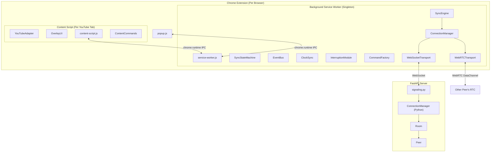
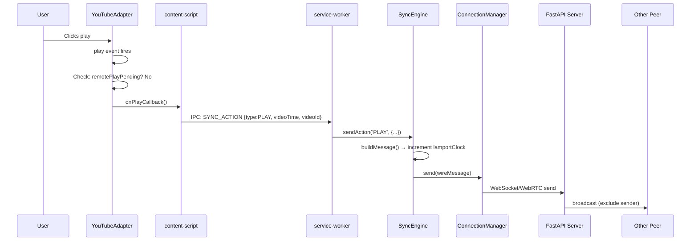
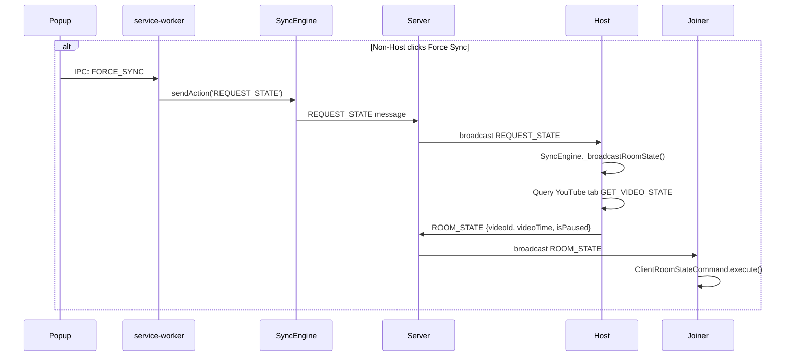
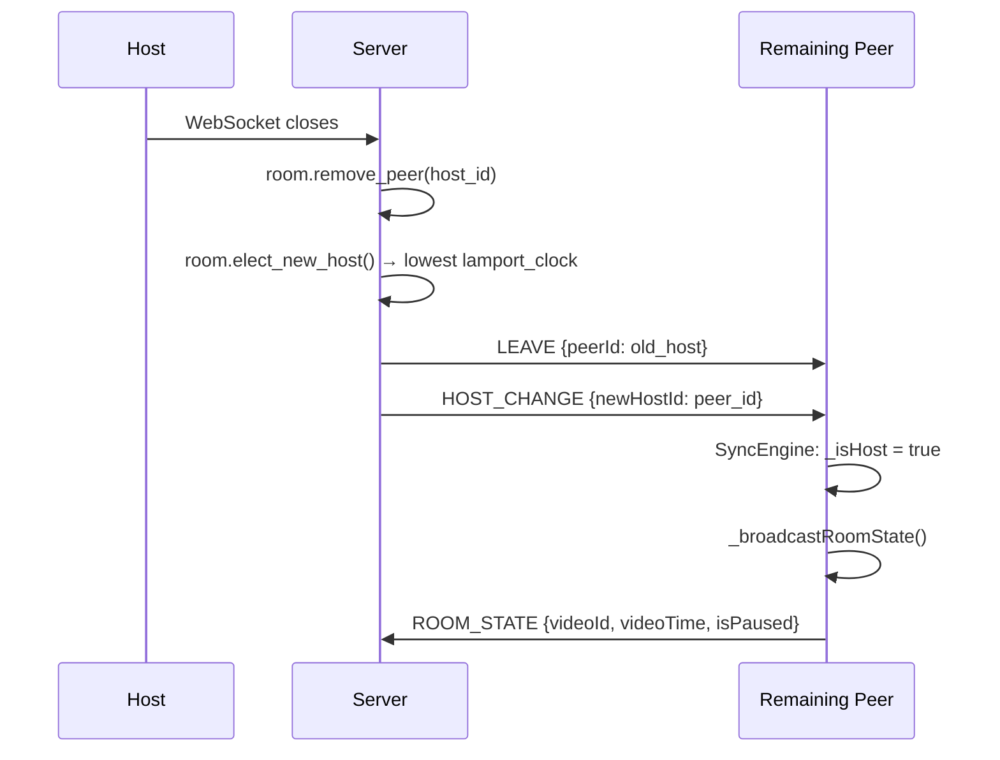

# SyncTube — Complete Project Technical Reference

> A Chrome Extension + FastAPI server system that synchronizes YouTube video playback (play, pause, seek) across multiple users in a shared room via WebSocket relay and WebRTC P2P.

---

## Table of Contents

- [Architecture Overview](#architecture-overview)
- [Wire Protocol](#wire-protocol)
- [Project File Tree](#project-file-tree)
- [Server (Python / FastAPI)](#server-python--fastapi)
- [Extension — Background (Service Worker)](#extension--background-service-worker)
- [Extension — Content Script (YouTube DOM)](#extension--content-script-youtube-dom)
- [Extension — Popup UI](#extension--popup-ui)
- [Design Patterns Used](#design-patterns-used)
- [Data Flow Diagrams](#data-flow-diagrams)

---

## Architecture Overview



### Process Model (OS Analogy)

| Chrome Concept | OS Analogy |
|---|---|
| Content Script | Sandboxed user process (DOM access, isolated JS) |
| Background Service Worker | Event-driven daemon (can be killed/respawned) |
| `chrome.runtime.sendMessage` | IPC message-passing (no shared memory) |
| Popup | Short-lived GUI process |

---

## Wire Protocol

Every message between peers follows this envelope:

```json
{
  "type": "PLAY | PAUSE | SEEK | FORCE_SYNC | ROOM_STATE | REQUEST_STATE | HEARTBEAT | PING | PONG | JOIN | LEAVE | HOST_CHANGE | SDP_OFFER | SDP_ANSWER | ICE_CANDIDATE",
  "roomId": "E7FQMS",
  "senderId": "peer_bb18df07",
  "lamportClock": 42,
  "payload": {
    "videoTime": 123.45,
    "videoId": "dQw4w9WgXcQ",
    "isPaused": false,
    "originTimestamp": 1737000000000
  }
}
```

| Field | Type | Purpose |
|---|---|---|
| `type` | `string` | Message type identifier |
| `roomId` | `string` | 6-char alphanumeric room code |
| `senderId` | `string` | `peer_` + 8-char UUID fragment |
| `lamportClock` | `number` | Logical clock for ordering concurrent commands |
| `payload.originTimestamp` | `number` | Wall-clock ms for latency compensation |
| `payload.videoTime` | `number` | Playback position in seconds |
| `payload.videoId` | `string` | YouTube video ID (`v=` parameter) |
| `payload.isPaused` | `boolean` | Whether video is paused |

---

## Project File Tree

```
sync/
├── server/                              # FastAPI Signaling/Relay Server
│   ├── main.py                          # App entry point, WebSocket endpoint
│   ├── requirements.txt                 # fastapi, uvicorn
│   └── app/
│       ├── config.py                    # Config singleton (DEBUG, REDIS_URL)
│       ├── core/
│       │   └── signaling.py             # WebSocket handler & message router
│       ├── managers/
│       │   └── connection_manager.py    # Room/peer lifecycle, broadcast
│       └── models/
│           ├── room.py                  # Room model with host election
│           └── peer.py                  # Peer model (WebSocket wrapper)
│
└── extension/                           # Chrome Extension (MV3)
    ├── manifest.json                    # MV3 manifest
    └── src/
        ├── background/                  # Service Worker (runs in background)
        │   ├── service-worker.js        # Entry point, IPC router
        │   ├── SyncEngine.js            # Central orchestrator (Mediator)
        │   ├── ConnectionManager.js     # Transport strategy selector
        │   ├── EventBus.js              # Pub/Sub event system
        │   ├── ClockSync.js             # RTT measurement & latency compensation
        │   ├── InterruptionModule.js    # Ad/buffering handling (Strategy)
        │   ├── commands/                # Command Pattern implementations
        │   │   ├── SyncCommand.js       # Abstract base + CommandFactory
        │   │   ├── PlayCommand.js
        │   │   ├── PauseCommand.js
        │   │   ├── SeekCommand.js
        │   │   ├── ForceSyncCommand.js
        │   │   ├── RoomStateCommand.js
        │   │   └── RequestStateCommand.js
        │   ├── state/
        │   │   └── SyncStateMachine.js  # FSM for session lifecycle
        │   └── transports/              # Strategy Pattern implementations
        │       ├── Transport.js         # Abstract base
        │       ├── WebSocketTransport.js # Relay via server
        │       └── WebRTCTransport.js   # P2P DataChannel
        │
        ├── content/                     # Content Script (runs per YouTube tab)
        │   ├── content-script.js        # Entry point, video detection, IPC
        │   ├── adapters/
        │   │   ├── VideoAdapter.js      # Abstract base (Adapter pattern)
        │   │   └── YouTubeAdapter.js    # YouTube-specific <video> wrapper
        │   ├── commands/
        │   │   └── ContentCommands.js   # Client-side Command Pattern
        │   └── ui/
        │       └── OverlayUI.js         # On-page status badge & toasts
        │
        └── popup/                       # Extension Popup UI
            ├── popup.html               # HTML layout
            └── popup.js                 # UI logic & IPC
```

---

## Server (Python / FastAPI)

---

### [`main.py`](file:///c:/Users/hp/Desktop/Projects/sync/server/main.py)

Entry point. Creates the FastAPI app, configures CORS, and defines endpoints.

| Symbol | Type | Purpose |
|---|---|---|
| `app` | `FastAPI` | Application instance |
| `root()` | `GET /` | Health check → `{"message": "...running"}` |
| `websocket_endpoint(ws, room_id, peer_id)` | `WS /ws/{room_id}/{peer_id}` | WebSocket endpoint. Delegates to `handle_websocket()` |

---

### [`app/config.py`](file:///c:/Users/hp/Desktop/Projects/sync/server/app/config.py)

| Symbol | Type | Purpose |
|---|---|---|
| `Config` | `class` | Settings container |
| `Config.DEBUG` | `bool` | `env:DEBUG` (default `true`) → verbose logging |
| `Config.REDIS_URL` | `str\|None` | `env:REDIS_URL` → future horizontal scaling |
| `config` | `Config` | Singleton instance |

---

### [`app/models/peer.py`](file:///c:/Users/hp/Desktop/Projects/sync/server/app/models/peer.py)

| Symbol | Signature | I/O |
|---|---|---|
| `Peer.__init__` | `(peer_id: str, websocket: WebSocket)` | Sets `self.id`, `self.websocket`, `self.lamport_clock = 0` |
| `Peer.send_json` | `async (data: dict) → None` | Sends JSON via the peer's WebSocket |

---

### [`app/models/room.py`](file:///c:/Users/hp/Desktop/Projects/sync/server/app/models/room.py)

| Symbol | Signature | I/O |
|---|---|---|
| `Room.__init__` | `(room_id: str)` | Initializes `peers: Dict`, `host_id`, `last_known_time`, `last_known_state`, `last_known_video_id` |
| `Room.add_peer` | `(peer: Peer) → None` | Adds peer to `self.peers`. If room was empty, assigns peer as `host_id` |
| `Room.remove_peer` | `(peer_id: str) → Optional[str]` | Removes peer. If removed peer was host → calls `elect_new_host()`. **Returns** new host's ID or `None` |
| `Room.elect_new_host` | `() → Optional[str]` | Sorts remaining peers by `(lamport_clock, peer_id)` ascending. Picks first. **Returns** new host ID or `None` if empty |

---

### [`app/managers/connection_manager.py`](file:///c:/Users/hp/Desktop/Projects/sync/server/app/managers/connection_manager.py)

Global singleton: `manager = ConnectionManager()`

| Symbol | Signature | I/O |
|---|---|---|
| `connect` | `async (ws, room_id, peer_id) → Room` | Accepts WebSocket, creates Room if needed, adds Peer. **Returns** the Room |
| `disconnect` | `async (room_id, peer_id) → (new_host_id, is_empty)` | Removes peer, deletes room if empty. **Returns** tuple: (new host ID or None, bool is_empty) |
| `broadcast` | `async (room_id, message, exclude_peer_id=None) → None` | Sends JSON to all peers in room except `exclude_peer_id` |
| `send_to_peer` | `async (room_id, target_peer_id, message) → None` | Sends JSON to a specific peer (WebRTC signaling) |
| `get_room` | `(room_id) → Optional[Room]` | Lookup room by ID |

---

### [`app/core/signaling.py`](file:///c:/Users/hp/Desktop/Projects/sync/server/app/core/signaling.py)

| Symbol | Signature | I/O |
|---|---|---|
| `handle_websocket` | `async (ws, room_id, peer_id) → None` | Main WS handler. Steps: 1) Connect peer 2) Send ROOM_STATE to joiner 3) Broadcast JOIN to others 4) Listen loop → `process_message()` 5) On disconnect → broadcast LEAVE, elect new host → broadcast HOST_CHANGE |
| `process_message` | `async (room, sender_id, message) → None` | Routes messages: Sync commands (PLAY/PAUSE/SEEK/FORCE_SYNC/ROOM_STATE/REQUEST_STATE/PING/PONG/HEARTBEAT) → broadcast to room. WebRTC signaling (SDP_OFFER/SDP_ANSWER/ICE_CANDIDATE) → routed to `targetPeerId`. State cache updated on ROOM_STATE/HEARTBEAT/PLAY/PAUSE/SEEK |
| `_create_room_state_message` | `(room, room_id) → dict` | Builds a ROOM_STATE envelope with cached `videoTime`, `isPaused`, `videoId`, `peers[]`, `hostId` |

---

## Extension — Background (Service Worker)

---

### [`service-worker.js`](file:///c:/Users/hp/Desktop/Projects/sync/extension/src/background/service-worker.js)

Entry point. Registers `chrome.runtime.onMessage` listener synchronously.

| Symbol | Signature | I/O |
|---|---|---|
| `getEngine` | `async () → SyncEngine` | Lazy-initializes singleton SyncEngine. Restores state from `chrome.storage.session` |
| `handleMessage` | `async (eng, message, sender) → object` | Routes IPC actions from popup/content scripts |

**IPC Actions Handled:**

| Action | Source | Effect |
|---|---|---|
| `CREATE_ROOM` | Popup | `eng.createRoom()` → returns `{roomId, peerId}` |
| `JOIN_ROOM` | Popup | `eng.joinRoom(payload.roomId)` → returns `{roomId, peerId}` |
| `LEAVE_ROOM` | Popup | `eng.leaveRoom()` |
| `GET_STATUS` | Popup/Content | `eng.getStatus()` → returns `{peerId, roomId, isHost, state, connected}` |
| `SYNC_ACTION` | Content | `eng.sendAction(payload.type, payload.data)` — forwards user play/pause/seek |
| `FORCE_SYNC` | Popup | Host: queries tab state → broadcasts `ROOM_STATE`. Non-host: sends `REQUEST_STATE` |
| `VIDEO_CHANGED` | Content | Host: queries tab → broadcasts `ROOM_STATE` with new videoId. Non-host: sends `REQUEST_STATE` |
| `INTERRUPTION_START` | Content | `eng.interruptionModule.handleInterruptionStart(...)` |
| `INTERRUPTION_END` | Content | `eng.interruptionModule.handleInterruptionEnd(...)` |

---

### [`SyncEngine.js`](file:///c:/Users/hp/Desktop/Projects/sync/extension/src/background/SyncEngine.js) — class `SyncEngine`

Central orchestrator. Coordinates all subsystems.

**Constructor creates:** `EventBus`, `ConnectionManager`, `SyncStateMachine`, `ClockSync`, `InterruptionModule`

| Method | Signature | I/O |
|---|---|---|
| `init` | `async () → void` | Restores `peerId`, `roomId`, `isHost`, `lamportClock` from `chrome.storage.session`. Generates new `peerId` if none stored |
| `createRoom` | `async () → {roomId, peerId}` | Generates 6-char room code, sets `_isHost=true`, transitions to JOINING, connects transport |
| `joinRoom` | `async (roomId: string) → {roomId, peerId}` | Uppercases code, sets `_isHost=false`, transitions to JOINING, connects transport |
| `ensureConnection` | `async () → void` | Re-connects transport if SW woke from sleep with a stored `_roomId` |
| `leaveRoom` | `async () → void` | Stops heartbeat, disconnects transport, resets state machine, clears storage |
| `handleSyncMessage` | `(wireMessage: object) → void` | Updates Lamport clock. Routes: HOST_CHANGE → update host flag + broadcast ROOM_STATE. PING → reply PONG. PONG → record RTT. HEARTBEAT → drift check. Others → deserialize via CommandFactory → emit `command:received` |
| `buildMessage` | `(type, payload) → object` | Constructs wire protocol envelope with incremented `lamportClock` and `originTimestamp` |
| `sendAction` | `(type, payload) → void` | Builds message → sends via `connectionManager.send()` |
| `handlePause` | `(userId, videoTime) → void` | Convenience: `sendAction('PAUSE', {videoTime})` |
| `handlePlay` | `(userId, videoTime) → void` | Convenience: `sendAction('PLAY', {videoTime})` |
| `getStatus` | `() → object` | Returns `{peerId, roomId, isHost, state, connected}` |
| `disconnect` | `() → void` | Calls `leaveRoom()` |
| `_broadcastStatusUpdate` | `() → void` | Sends `UPDATE_STATUS` IPC to popup (silently fails if popup closed) |
| `_setupEventHandlers` | `() → void` | Wires `connection:established` → SYNCING + REQUEST_STATE (if joiner). `connection:closed` → reset. `command:received` → routes to YouTube tabs via `APPLY_COMMAND` IPC |
| `_startHeartbeat` | `() → void` | Every 5s: Host queries tab → broadcasts HEARTBEAT. Non-host sends PING. Disconnects host if 0 YouTube tabs |
| `_stopHeartbeat` | `() → void` | Clears the heartbeat interval |
| `_broadcastRoomState` | `() → void` | Queries YouTube tabs for video state → sends `ROOM_STATE` to peers (first valid watch tab only) |
| `_persistState` | `async () → void` | Writes `{peerId, roomId, isHost, lamportClock}` to `chrome.storage.session` |

**Properties:** `peerId` (getter), `roomId` (getter), `isHost` (getter)

**Helper Functions (module-level):**

| Function | Signature | I/O |
|---|---|---|
| `generateRoomCode` | `() → string` | Random 6-char code using unambiguous charset `ABCDEFGHJKLMNPQRSTUVWXYZ23456789` |
| `generatePeerId` | `() → string` | `"peer_" + crypto.randomUUID().slice(0, 8)` |

---

### [`EventBus.js`](file:///c:/Users/hp/Desktop/Projects/sync/extension/src/background/EventBus.js) — class `EventBus`

Observer pattern pub/sub. Internal state: `_listeners: Map<string, Set<Function>>`

| Method | Signature | I/O |
|---|---|---|
| `on` | `(event: string, callback: Function) → Function` | Subscribes. **Returns** unsubscribe function |
| `off` | `(event: string, callback: Function) → void` | Unsubscribes specific handler |
| `emit` | `(event: string, ...args) → void` | Calls all handlers for event. Errors are caught & logged |
| `once` | `(event: string, callback: Function) → Function` | Subscribe for single invocation, then auto-unsubscribe |
| `clear` | `(event?: string) → void` | Removes all listeners (or for a specific event) |

**Events used in the system:**

| Event | Emitted By | Payload |
|---|---|---|
| `connection:established` | ConnectionManager | `{roomId, peerId}` |
| `connection:closed` | ConnectionManager | (none) |
| `connection:reconnecting` | ConnectionManager | (none) |
| `command:received` | SyncEngine | `{command, senderId, type}` |
| `state:changed` | SyncStateMachine | `{current, previous}` |
| `transport:upgraded` | ConnectionManager | `{transport: 'WebRTC'}` |
| `transport:downgraded` | ConnectionManager | `{transport: 'WebSocket'}` |

---

### [`ConnectionManager.js`](file:///c:/Users/hp/Desktop/Projects/sync/extension/src/background/ConnectionManager.js) — class `ConnectionManager`

Hybrid transport strategy. Threshold: `P2P_THRESHOLD = 5` users.

| Method | Signature | I/O |
|---|---|---|
| `connect` | `async (roomId, peerId) → void` | Connects WS transport (always), initializes RTC transport. Starts with WS as active |
| `send` | `(message: object) → void` | Routes through active transport. Falls back to WS if RTC is active but disconnected |
| `onMessage` | `(callback: Function) → void` | Registers app-level message handler (SyncEngine) |
| `updateRoomSize` | `(size: number) → void` | Tracks peer count. Switches to WS relay if room > 5. Triggers transport eval |
| `disconnect` | `async () → void` | Disconnects both transports, emits `connection:closed` |
| `isConnected` | `() → boolean` | `true` if WebSocket is connected |
| `_handleWebSocketMessage` | `(message) → void` | Routes SDP/ICE to RTC transport. Updates room size on JOIN/LEAVE/ROOM_STATE. Forwards app messages if WS is active OR message is structural |
| `_handleWebRTCMessage` | `(message) → void` | Forwards directly to app callback |
| `_scheduleTransportEval` | `() → void` | Debounced (300ms) transport upgrade/downgrade check |
| `_evaluateTransportState` | `() → void` | If room ≤ 5 and all DataChannels open → upgrade to RTC. If channels < expected → downgrade to WS |

**Properties:** `roomId` (getter), `peerId` (getter)

---

### [`ClockSync.js`](file:///c:/Users/hp/Desktop/Projects/sync/extension/src/background/ClockSync.js) — class `ClockSync`

Cristian's Algorithm for latency compensation. Keeps up to 10 RTT samples.

| Method | Signature | I/O |
|---|---|---|
| `estimateDelay` | `(originTimestamp: number) → number` | Naive one-way delay estimate: `(now - origin) / 2`. **Returns** delay in ms |
| `compensateTime` | `(videoTime: number, originTimestamp: number) → number` | If RTT samples exist → uses averaged delay. Otherwise → naive fallback. **Returns** compensated video time in seconds |
| `recordRTT` | `(rttMs: number) → void` | Adds RTT sample, trims to 10, recalculates `_estimatedDelay = avg(RTT)/2` |
| `estimatedDelay` | getter | Current one-way delay in ms |

---

### [`InterruptionModule.js`](file:///c:/Users/hp/Desktop/Projects/sync/extension/src/background/InterruptionModule.js)

Strategy Pattern for ad/buffering handling.

**Strategies:**

| Class | `handleStart` | `handleEnd` |
|---|---|---|
| `PauseAllPolicy` | Pauses room for everyone | Resumes room if no users still interrupted |
| `IgnorePolicy` | No-op | No-op (interrupted user catches up normally) |

**`InterruptionModule` class:**

| Method | Signature | I/O |
|---|---|---|
| `constructor` | `(syncEngine, connectionManager)` | Default policy: `PAUSE_ALL` |
| `setPolicy` | `(policyName: string) → void` | Switch to `'PAUSE_ALL'` or `'IGNORE'` |
| `handleInterruptionStart` | `(userId, videoId, videoTime) → void` | Marks user interrupted, delegates to policy |
| `handleInterruptionEnd` | `(userId, videoId, videoTime) → void` | Clears user, delegates to policy |
| `clearUser` | `(userId) → void` | Remove a single user's interrupted flag |
| `clearAll` | `() → void` | Clear all interruption state |

---

### [`SyncStateMachine.js`](file:///c:/Users/hp/Desktop/Projects/sync/extension/src/background/state/SyncStateMachine.js)

Finite state machine with strict transition validation.

**States:** `DISCONNECTED`, `JOINING`, `SYNCING`, `SYNCED`, `DRIFTING`, `RECONNECTING`

**Allowed Transitions:**

| From | To |
|---|---|
| `DISCONNECTED` | `JOINING` |
| `JOINING` | `SYNCING`, `DISCONNECTED` |
| `SYNCING` | `SYNCED`, `DRIFTING`, `DISCONNECTED`, `RECONNECTING` |
| `SYNCED` | `DRIFTING`, `DISCONNECTED`, `RECONNECTING` |
| `DRIFTING` | `SYNCING`, `SYNCED`, `DISCONNECTED`, `RECONNECTING` |
| `RECONNECTING` | `JOINING`, `DISCONNECTED` |

| Method | Signature | I/O |
|---|---|---|
| `state` | getter | Current state string |
| `previousState` | getter | Previous state string or null |
| `transition` | `(newState: string) → boolean` | Validates transition, updates state, emits `state:changed`. **Throws** on invalid transition |
| `canTransition` | `(targetState: string) → boolean` | Check if transition is valid without performing it |
| `reset` | `() → void` | Force-resets to DISCONNECTED (bypasses validation) |

---

### Commands ([`commands/`](file:///c:/Users/hp/Desktop/Projects/sync/extension/src/background/commands))

All extend `SyncCommand` and self-register via `CommandFactory.register(type, Class)`.

#### [`SyncCommand.js`](file:///c:/Users/hp/Desktop/Projects/sync/extension/src/background/commands/SyncCommand.js)

| Class | Method | I/O |
|---|---|---|
| `SyncCommand` | `constructor(payload)` | Stores payload |
| | `execute(adapter)` | Abstract — throws |
| | `serialize()` | Returns `{...this.payload}` |
| `CommandFactory` | `register(type, Class)` | Static. Maps type string → Command class |
| | `fromWireMessage(wireMessage)` | Static. **Input:** full wire message. **Returns:** instantiated Command or `null` |

#### Concrete Commands:

| Command | `execute(adapter)` | `serialize()` returns |
|---|---|---|
| [`PlayCommand`](file:///c:/Users/hp/Desktop/Projects/sync/extension/src/background/commands/PlayCommand.js) | Seeks (if videoTime set), then plays | `{videoTime, videoId}` |
| [`PauseCommand`](file:///c:/Users/hp/Desktop/Projects/sync/extension/src/background/commands/PauseCommand.js) | Pauses, then seeks (if videoTime set) | `{videoTime, videoId}` |
| [`SeekCommand`](file:///c:/Users/hp/Desktop/Projects/sync/extension/src/background/commands/SeekCommand.js) | Seeks to `payload.videoTime` | `{videoTime, videoId}` |
| [`ForceSyncCommand`](file:///c:/Users/hp/Desktop/Projects/sync/extension/src/background/commands/ForceSyncCommand.js) | Seeks to `payload.videoTime`, then plays | `{videoTime, videoId}` |
| [`RoomStateCommand`](file:///c:/Users/hp/Desktop/Projects/sync/extension/src/background/commands/RoomStateCommand.js) | Seeks (if videoTime), then play/pause based on `isPaused` | `{videoId, videoTime, isPaused}` |
| [`RequestStateCommand`](file:///c:/Users/hp/Desktop/Projects/sync/extension/src/background/commands/RequestStateCommand.js) | No-op (intercepted by SyncEngine) | `{}` |

---

### Transports ([`transports/`](file:///c:/Users/hp/Desktop/Projects/sync/extension/src/background/transports))

#### [`Transport.js`](file:///c:/Users/hp/Desktop/Projects/sync/extension/src/background/transports/Transport.js) — Abstract base

| Method | Signature |
|---|---|
| `connect` | `async (roomId, peerId) → void` |
| `send` | `(message: object) → void` |
| `onMessage` | `(callback: Function) → void` |
| `isConnected` | `() → boolean` |
| `disconnect` | `async () → void` |

#### [`WebSocketTransport.js`](file:///c:/Users/hp/Desktop/Projects/sync/extension/src/background/transports/WebSocketTransport.js)

Connects to `ws://127.0.0.1:8000/ws/{roomId}/{peerId}`. Reconnection: exponential backoff 1s → 30s cap, max 10 attempts.

| Method | Signature | I/O |
|---|---|---|
| `connect` | `async (roomId, peerId) → void` | Stores IDs, resets reconnect state, calls `_doConnect()` |
| `_doConnect` | `() → Promise<void>` | Opens WebSocket, resolves on `onopen`, rejects on `onerror` |
| `_scheduleReconnect` | `() → void` | Exponential backoff: `delay = min(1000 * 2^attempt, 30000)` |
| `onClose` | `(callback) → void` | Register unexpected-close callback |
| `send` | `(message) → void` | `JSON.stringify` → `ws.send()` |
| `onMessage` | `(callback) → void` | Register message callback (called with parsed JSON) |
| `isConnected` | `() → boolean` | Returns `_connected` flag |
| `disconnect` | `async () → void` | Sets `_intentionalClose=true`, cancels reconnect timer, closes WS |

#### [`WebRTCTransport.js`](file:///c:/Users/hp/Desktop/Projects/sync/extension/src/background/transports/WebRTCTransport.js)

P2P mesh via RTCDataChannel. STUN servers: `stun.l.google.com:19302`.

| Method | Signature | I/O |
|---|---|---|
| `connect` | `async (roomId, peerId) → void` | Stores IDs (connections are demand-driven) |
| `onSignaling` | `(callback) → void` | Register outbound signaling callback (routed through WS) |
| `hasPeerConnection` | `(peerId) → boolean` | Check if connection exists to peer |
| `connectToPeer` | `async (peerId) → void` | Creates `RTCPeerConnection`, creates DataChannel (`ordered:true, maxRetransmits:3`), creates & sends SDP offer |
| `handleOffer` | `async (senderId, sdp) → void` | Creates peer connection, sets remote description, creates & sends SDP answer |
| `handleAnswer` | `async (senderId, sdp) → void` | Sets remote description on existing connection |
| `handleIceCandidate` | `async (senderId, candidate) → void` | Adds ICE candidate to peer connection |
| `removePeer` | `(peerId) → void` | Closes DataChannel + PeerConnection, re-evaluates connected state |
| `send` | `(message) → void` | `JSON.stringify` → sends to ALL open DataChannels |
| `isConnected` | `() → boolean` | `true` if ≥ 1 open DataChannel |
| `getOpenChannelCount` | `() → number` | Count of DataChannels with `readyState === 'open'` |
| `disconnect` | `async () → void` | Removes all peers |
| `onChannelStateChange` | `(callback) → void` | Register callback for connectivity changes |
| `_createPeerConnection` | `(peerId) → RTCPeerConnection` | Creates PC with ICE handlers, data channel receiver, connection state monitor |
| `_setupDataChannel` | `(peerId, dc) → void` | Wires open/close/message handlers |
| `_sendSignaling` | `(type, payload) → void` | Sends signaling message via registered callback |

---

## Extension — Content Script (YouTube DOM)

---

### [`content-script.js`](file:///c:/Users/hp/Desktop/Projects/sync/extension/src/content/content-script.js)

IIFE that runs in every YouTube tab. Bridges YouTubeAdapter ↔ Service Worker.

| Function | Signature | I/O |
|---|---|---|
| `isContextValid` | `() → boolean` | `true` if `chrome.runtime.id` exists |
| `handleContextInvalidated` | `() → void` | Tears down adapter/overlay on extension reload |
| `detectVideo` | `() → void` | Polls every 500ms (max 60 attempts) for `video.html5-main-video` element |
| `onVideoFound` | `(videoElement: HTMLVideoElement) → void` | Creates `YouTubeAdapter`, `OverlayUI`. Wires user actions (play/pause/seek/video change/interruptions) → `sendToBackground()` IPC |
| `sendToBackground` | `(action, payload, callback?) → void` | Wraps `chrome.runtime.sendMessage`. Detects "Extension context invalidated" errors |
| `extractVideoId` | `() → string\|null` | Parses `?v=` from `window.location` |
| `handleNavigation` | `() → void` | Compares current URL to `lastUrl`. If video changed → cleanup → re-detect. If same video → `adapter.checkVideoIdChange()` |
| `isVideoPage` | `() → boolean` | `true` if path starts with `/watch`, `/shorts/`, or `/embed/` |
| `cleanup` | `() → void` | Destroys adapter + overlay, resets state |

**IPC Messages Handled (from background):**

| Action | Handler |
|---|---|
| `APPLY_COMMAND` | Checks videoId mismatch (skips if wrong video). Deserializes via `ClientCommandFactory.fromWireMessage()` → `adapter.applyRemoteCommand(cmd)` |
| `UPDATE_STATUS` | `overlay.updateStatus(payload)` |
| `SHOW_TOAST` | `overlay.showToast(payload.text, payload.duration)` |
| `GET_VIDEO_STATE` | Returns `{videoTime, duration, videoId, isPaused, isReady}` from adapter |
| `GET_DEBUG_STATE` | Returns full internal debug snapshot from adapter |

**SPA Navigation Strategies:**
1. `yt-navigate-finish` event (YouTube-native, fastest)
2. `MutationObserver` on `<title>` element (fallback)
3. `history.pushState`/`replaceState` monkey-patching + `popstate` (most reliable)

---

### [`VideoAdapter.js`](file:///c:/Users/hp/Desktop/Projects/sync/extension/src/content/adapters/VideoAdapter.js) — Abstract Base

Attached to `window.SyncTube.VideoAdapter`. All methods throw "not implemented".

| Method | Signature | I/O |
|---|---|---|
| `play` | `() → void` | Start playback |
| `pause` | `() → void` | Pause playback |
| `seek` | `(time: number) → void` | Seek to time in seconds |
| `getCurrentTime` | `() → number` | Current time in seconds |
| `getDuration` | `() → number` | Video duration in seconds |
| `isPaused` | `() → boolean` | Whether video is paused |
| `getVideoId` | `() → string\|null` | Platform video ID |
| `isReady` | `() → boolean` | Whether video is ready for commands |
| `onUserPlay` | `(callback) → void` | Register play callback |
| `onUserPause` | `(callback) → void` | Register pause callback |
| `onUserSeek` | `(callback) → void` | Register seek callback |
| `onVideoChange` | `(callback) → void` | Register video change callback |
| `onInterruptionStart` | `(callback) → void` | Register interruption start callback |
| `onInterruptionEnd` | `(callback) → void` | Register interruption end callback |
| `applyRemoteCommand` | `(command) → void` | Apply a remote command with echo suppression |
| `destroy` | `() → void` | Cleanup |

---

### [`YouTubeAdapter.js`](file:///c:/Users/hp/Desktop/Projects/sync/extension/src/content/adapters/YouTubeAdapter.js) — Concrete Implementation

Extends `VideoAdapter`. Handles YouTube-specific quirks.

**Echo Suppression (two-layer defense):**

| Layer | Mechanism | Purpose |
|---|---|---|
| Layer 1 — State Checks | `play()` skips if `!video.paused`; `pause()` skips if `video.paused`; `seek()` skips if `|currentTime - target| < 0.5s` | If state already matches, no DOM call → no event → no echo |
| Layer 2 — Consumed Flags | `_remotePlayPending` / `_remotePausePending` / `_isProgrammaticSeek` set before DOM call, consumed by event handler | Catches async events for state-changing commands |
| Page-load Window | `_suppressUntil = Date.now() + 2000` | Suppresses YouTube's spurious load events for first 2 seconds |

| Method | Key Behavior |
|---|---|
| `attach(videoElement)` | Sets up all event listeners, video ID polling (1s interval), MutationObserver for `.ad-showing` |
| `play()` | Guard: ad playing? Already playing? → skip. Sets `_remotePlayPending=true`, calls `video.play()` |
| `pause()` | Guard: ad playing? Already paused? → skip. Sets `_remotePausePending=true`, calls `video.pause()` |
| `seek(time)` | Clamps to `[0, duration]`. Guard: ad? Within 0.5s? → skip. Sets `_isProgrammaticSeek=true` |
| `getVideoId()` | Parses URL: `/watch?v=`, `/shorts/`, `/embed/` patterns |
| `isReady()` | `video.readyState >= 2` (HAVE_CURRENT_DATA) |
| `applyRemoteCommand(cmd)` | Calls `cmd.execute(this)` — echo suppression handled by play/pause/seek internally |
| `destroy()` | Aborts all listeners via `AbortController`, clears timers, observer, references |

**Event Listeners:**

| Event | Handler Logic |
|---|---|
| `play` | If `_remotePlayPending` → consume & skip. If within page-load window → skip. If ad → skip. Otherwise → fire `_onPlayCallback()` |
| `pause` | If `_remotePausePending` → consume & skip. If page-load/ad/video.ended/buffering → skip. Otherwise → fire `_onPauseCallback()` |
| `seeking` | Records `_preSeekTime` on first event |
| `seeked` | If `_isProgrammaticSeek` → consume & skip. Debounces 250ms, only reports seeks > 1.0s delta → fires `_onSeekCallback(newTime)` |
| `waiting` | Sets `_isBuffering=true` → evaluates interruption state |
| `playing` | Sets `_isBuffering=false` → evaluates interruption state |

**Ad Detection:**
- `MutationObserver` watches `.html5-video-player` for class changes
- Detects `.ad-showing` or `.ad-interrupting` CSS classes

---

### [`ContentCommands.js`](file:///c:/Users/hp/Desktop/Projects/sync/extension/src/content/commands/ContentCommands.js)

Client-side Command Pattern mirror. Attached to `window.SyncTube.ClientCommandFactory`.

| Class | `execute(adapter)` |
|---|---|
| `ClientPlayCommand` | Seeks (if videoTime), plays |
| `ClientPauseCommand` | Pauses, seeks (if videoTime) |
| `ClientSeekCommand` | Seeks to videoTime |
| `ClientForceSyncCommand` | Seeks to videoTime, plays |
| `ClientRoomStateCommand` | If videoId mismatch → SPA-navigate via hidden `<a>` click (`/watch?v={id}&t={time}s`). If match → seek + play/pause |

`ClientCommandFactory.fromWireMessage(payload)` — **Input:** `{type, command}`. **Returns:** instantiated command or `null`.

---

### [`OverlayUI.js`](file:///c:/Users/hp/Desktop/Projects/sync/extension/src/content/ui/OverlayUI.js)

On-page floating status badge. Attached to `window.SyncTube.OverlayUI`.

| Method | Signature | I/O |
|---|---|---|
| `inject` | `() → void` | Creates fixed-position container (z-index 999999) with badge + toast elements. Appends to `document.body` |
| `updateStatus` | `(status: {state, roomId}) → void` | Shows/hides badge. Colors: SYNCED=#4caf50 (green), SYNCING=#2196f3 (blue), DRIFTING=#ff9800 (orange), RECONNECTING=#f44336 (red), JOINING=#9c27b0 (purple), DISCONNECTED=#757575 (grey) |
| `showToast` | `(text, durationMs=3000) → void` | Shows temporary message, fades out after duration |
| `destroy` | `() → void` | Removes container from DOM |

---

## Extension — Popup UI

---

### [`popup.html`](file:///c:/Users/hp/Desktop/Projects/sync/extension/src/popup/popup.html)

HTML layout with two views: disconnected (create/join) and connected (room code, force sync, leave).

### [`popup.js`](file:///c:/Users/hp/Desktop/Projects/sync/extension/src/popup/popup.js)

IIFE. Fetches status on open, renders UI, handles button clicks.

| Function | Signature | I/O |
|---|---|---|
| `sendMessage` | `(action, payload) → Promise<object>` | Wraps `chrome.runtime.sendMessage` in a Promise |
| `updateUI` | `(status: object) → void` | Shows/hides disconnected/connected views. Sets status dot color + label text |
| `showError` | `(text: string) → void` | Shows error below join input for 4 seconds |
| `init` | `async () → void` | Calls `GET_STATUS` → `updateUI()` |

**Button Handlers:**

| Button | Action |
|---|---|
| Create Room | `sendMessage('CREATE_ROOM')` |
| Join Room | Validates input ≥ 4 chars → `sendMessage('JOIN_ROOM', {roomId})` |
| Force Sync | `sendMessage('FORCE_SYNC')` |
| Leave Room | `sendMessage('LEAVE_ROOM')` |

---

## Design Patterns Used

| Pattern | Where | Purpose |
|---|---|---|
| **Adapter** | `VideoAdapter` → `YouTubeAdapter` | Platform-agnostic video control interface |
| **Command** | `SyncCommand` → `Play/Pause/Seek/...Command` | Serialize/deserialize/execute playback actions uniformly |
| **Factory** | `CommandFactory`, `ClientCommandFactory` | Deserialize wire messages into typed Command objects |
| **Strategy** | `Transport` → `WebSocketTransport` / `WebRTCTransport` | Swappable transport algorithms |
| **Strategy** | `InterruptionPolicy` → `PauseAllPolicy` / `IgnorePolicy` | Swappable interruption handling |
| **State** | `SyncStateMachine` | Strict FSM for session lifecycle |
| **Observer** | `EventBus` | Decoupled pub/sub between components |
| **Singleton** | `SyncEngine`, `ConnectionManager` (Python) | Single instance per process |
| **Mediator** | `SyncEngine` | Coordinates all subsystems |

---

## Data Flow Diagrams

### User Plays Video (Host Side)



### Force Sync Flow



### Host Migration Flow


